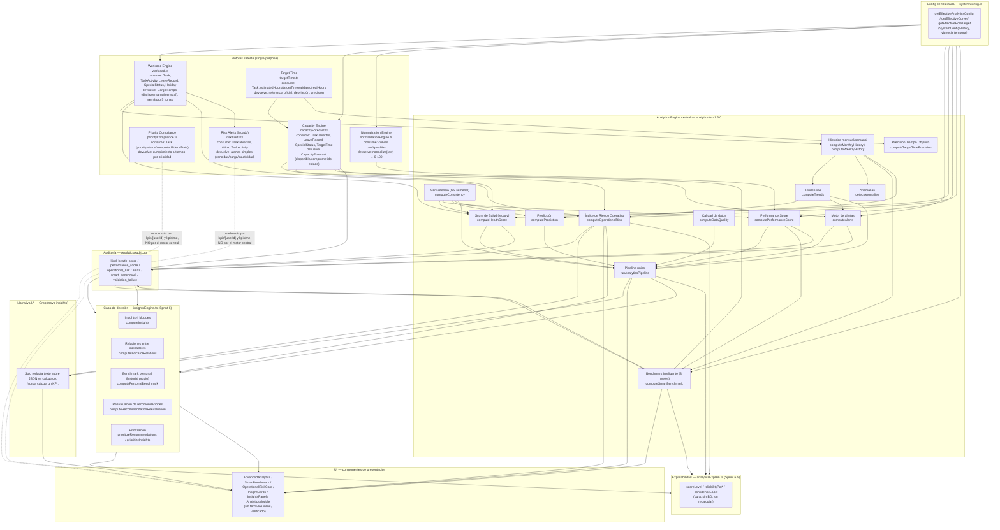

# Analytics Calculation Registry

**Sprint: Consolidación del Analytics Engine — Auditoría técnica**
Fecha: 2026-07-21
Alcance: solo lectura/documentación. No se modificó Prisma, APIs públicas, componentes visuales, KPIs existentes ni fórmulas validadas.

---

## FASE 1 — Inventario de cálculos

### 1.1 Motor central (`src/lib/analytics.ts`, v1.5.0 / `FORMULA_SET_VERSION` 4.2)

| Indicador | Función | Dependencias | Origen de datos |
|---|---|---|---|
| Score simple (legacy, 0-100) | `computeSimpleScore` | — (pura) | `completedPct`, `cargaRatio`/`cargaPct`, `avgProgress`, `totalComments` (todos calculados por el caller) |
| Ratio horas estimadas/reales | `computeEstimatedVsRealRatio` | — (pura) | `Task.estimatedHours`, `Task.realHours` |
| Histórico mensual (base de tendencias/anomalías) | `computeMonthlyHistory` | `businessCalendarDay`, `businessDayRealRange`, `isBusinessDay`, `monthlyBusinessBase`, `isTaskOverdue` | `Task`, `TaskActivity` |
| Histórico semanal (consistencia/predicción/alertas) | `computeWeeklyHistory` | `businessCalendarDay`, `businessDayRealRange`, `getHolidaySet`, `getEffectiveHorasEfectivas`, `isWorkingDay`, `countBusinessDays` | `Task`, `TaskActivity` |
| Tendencias (cumplimiento/carga vs. semana/mes/6 meses) | `computeTrends` (+ `computeTrendGeneric`, `computeCargaTrend`) | `computeMonthlyHistory`, `computeWeeklyHistory` | resultado de las dos funciones anteriores |
| Fecha efectiva de inicio de historial | `computeEffectiveHistoryStart` | — | `User.kpiStartDate`, `User.createdAt`, primer `TaskActivity`, primera tarea completada, primera imputación de horas |
| Consistencia (CV semanal) | `computeConsistency` (+ `consistencyLevelFromCv`, `consistencyPctFromCv`, `consistencyReliabilityFromWeeks`) | `computeWeeklyHistory`, `computeEffectiveHistoryStart`, `getLeaveMinutesByDay`, `getHolidaySet`, `isWorkingDay` | `Task`, `TaskActivity`, `LeaveRecord` |
| Detección de anomalías | `detectAnomalies` | `computeMonthlyHistory`, `getEffectiveAnalyticsConfig` | histórico mensual |
| Predicción (próxima semana / cierre de mes) | `computePrediction` (+ `computePredictionConfidencePct`, `computeMonthlyCompliancePace`) | `computeWeeklyHistory`, `computeCargaTiempo`, `computeConsistency`, `getEffectiveAnalyticsConfig` | `Task` (regresión lineal simple sobre horas semanales), `computeCargaTiempo` |
| Score de Salud Laboral (LEGACY) | `computeHealthScore` (+ `cargaHealthScore`, `consistencyToScore`, `capacityToScore`) | `computeCargaTiempo`, `computeCapacityForecast`, `computeConsistency`, `monthlyBusinessBase`, `getEffectiveAnalyticsConfig` | `Task` del mes en curso + los 3 anteriores |
| Performance Score | `computePerformanceScore` (+ `computeTrazabilidadRaw`) | `computeConsistency`, `computeWeeklyHistory`, `normalize` (NormalizationEngine), `getEffectiveCurve`, `getEffectiveAnalyticsConfig` | `Task`, `Comment`, `TaskActivity` del mes en curso |
| Índice de Riesgo Operativo | `computeOperationalRisk` (+ `computeSeguimientoConcentration`, `classifyOperationalRisk`) | `computeCapacityForecast`, `computeTrends`, `computeConsistency`, `computeCargaTiempo`, `getEffectiveAnalyticsConfig` | `Task` abiertas, `TaskActivity` de tipo SEGUIMIENTO |
| Tendencia de score (semana/mes/6m) | `getScoreTrendHistory` (+ `getScoredAuditHistory`, `closestScoredPoint`) | `AnalyticsAuditLog` (kind `performance_score`/`operational_risk`) | tabla de auditoría, no recalcula |
| Calidad de los datos | `computeDataQuality` | — | `Task` (sin estimar, fechas inconsistentes), `SystemConfigHistory` |
| Precisión del Tiempo Objetivo | `computeTargetTimePrecision` | `getOfficialTargetTime`, `isTargetTimeValidated`, `computePrecisionPct`, `precisionClassification` (todas de `targetTime.ts`) | `Task` completadas del mes con horas reales > 0 |
| Motor de alertas automáticas | `computeAlerts` | `computeCapacityForecast`, `computeCargaHistory`, `computeTrends`, `computeMonthlyHistory`, `computeWeeklyHistory`, `getEffectiveAnalyticsConfig` | agregación de los cálculos anteriores + `Task` abiertas |
| Historial de alertas resueltas | `getResolvedAlertsHistory` | `AnalyticsAuditLog` (kind `alerts`) | tabla de auditoría |
| Recomendaciones de redistribución (equipo) | `computeTeamRecommendations` | `computeTeamCapacityForecast`, `capacityToScore`, `classifyCapacity`, `getEffectiveAnalyticsConfig` | `capacityForecast.ts` por miembro |
| Validación de consistencia matemática | `validateAnalyticsConsistency`, `validateCumplimientoConsistency` | — | resultados ya calculados de otros KPIs (doble-check, no recalcula) |
| Pipeline único del motor | `runAnalyticsPipeline` | orquesta: `computeDataQuality`, `computeConsistency`, `computeHealthScore`, `computePerformanceScore`, `computeTrends`, `computePrediction`, `computeCapacityForecast`, `validateAnalyticsConsistency`, `detectAnomalies`, `computeAlerts`, `getResolvedAlertsHistory` | — |
| Motor de Benchmarks Inteligente (3 niveles) | `computeSmartBenchmark` (+ `buildCargoBenchmark`, `buildCargoBenchmarkCarga`, `buildCargoLimitadoBenchmark`, `buildPersonalFromAuditHistory`, `buildPersonalFromWorkHistory`, `buildPersonalCapacidadFutura`) | `computePerformanceScore`, `computeOperationalRisk`, `computeMonthlyHistory`, `computeCapacityForecast`, `getEffectiveRoleTarget`, `getScoredAuditHistory` | pares del mismo `Role`, `AnalyticsAuditLog`, `computeMonthlyHistory`/`computeWeeklyHistory` |
| Evolución Personal | `computePersonalEvolution` | `getScoredAuditHistory`, `closestScoredPoint` | `AnalyticsAuditLog` (kind `performance_score`) |

### 1.2 Motores satélite (single-purpose, importados por analytics.ts)

| Indicador | Archivo / función | Dependencias | Origen de datos |
|---|---|---|---|
| Carga laboral (diaria/semanal/mensual) | `src/lib/workload.ts` → `computeCargaTiempo`, `computeCargaHistory` (+ `computeWorkloadRange`, `computeWorkloadPct`, `sumWeightedBaseHours`, `monthlyBusinessBase`, `monthlyBusinessBaseForUsers`) | `businessTime.ts`, `holidays.ts`, `leaves.ts`, `specialStatus.ts`, `systemConfig.ts` | `Task` (FIJA), `TaskActivity`, `LeaveRecord`, `SpecialStatus`, `SystemConfigHistory`, `Holiday` |
| Capacidad disponible/proyectada | `src/lib/capacityForecast.ts` → `computeTeamCapacityForecast`, `computeCapacityForecast` (+ `classifyCapacity`) | `businessTime.ts`, `holidays.ts`, `leaves.ts`, `specialStatus.ts`, `workload.ts` (`isWorkingDay`, `countBusinessDays`, `sumWeightedBaseHours`), `targetTime.ts` (`getOfficialTargetTime`) | `Task` (PENDIENTE/EN_PROGRESO), `LeaveRecord`, `SpecialStatus`, `Holiday` |
| Cumplimiento por prioridad | `src/lib/priorityCompliance.ts` → `computePriorityCompliance` (+ `isCompletedOnTime`) | — (pura) | tareas del período con `priority`/`status`/`completedAt`/`endDate` |
| Normalización 0-100 (curvas) | `src/lib/normalizationEngine.ts` → `normalize`, `interpolateCurve` | `getEffectiveCurve` (systemConfig.ts) | puntos de control configurables (`SystemConfigHistory`) o `DEFAULT_CURVES` |
| Tiempo Objetivo / desviación / precisión | `src/lib/targetTime.ts` → `getOfficialTargetTime`, `computeDeviation`, `computePrecisionPct`, `precisionClassification`, `buildHistoricalDeviationInsight` | — (puras) | `Task.estimatedHours`/`targetTimeValidated`/`realHours` |
| Configuración efectiva del motor | `src/lib/systemConfig.ts` → `getEffectiveAnalyticsConfig`, `getEffectiveCurve`, `getEffectiveRoleTarget`, `getEffectiveHorasEfectivas`, `getEffectiveWorkloadLimit{Low,High,Overload}` | — | `SystemConfigHistory` (con vigencia temporal) |
| Alertas de riesgo (legado, panel "Mis KPIs") | `src/lib/riskAlerts.ts` → `computeRiskAlerts` | `isTaskOverdue`, `businessCalendarDay`, `isBusinessDay` | `Task` abiertas, último `TaskActivity`, `WorkloadLabel`/`cargaPct` recibidos como parámetro |

### 1.3 Capa de decisión / narrativa (Sprint 6, sin recalcular KPIs)

| Indicador | Archivo / función | Dependencias | Origen de datos |
|---|---|---|---|
| Insights de 4 bloques | `src/lib/insightsEngine.ts` → `computeInsights` | factores de `computeOperationalRisk` (ya calculados), `computeMonthlyHistory` | `OperationalRiskResult.factors`, histórico mensual |
| Relaciones entre indicadores | `computeIndicatorRelations` | — (pura, recibe todo ya calculado) | histórico mensual, consistencia, riesgo, capacidad |
| Benchmark personal (Performance Score) | `computePersonalBenchmark` | `AnalyticsAuditLog` (kind `performance_score`) | tabla de auditoría |
| Reevaluación de recomendaciones | `computeRecommendationReevaluation` | `AnalyticsAuditLog` (kind `alerts`/`operational_risk`) | tabla de auditoría |
| Priorización (S6-H) | `prioritizeRecommendations`, `prioritizeInsights` | — (pura) | listas ya calculadas de recomendaciones/insights |
| Confianza (★) de Insights | `computeConfidence` | — (pura) | observaciones, calidad de datos, consistencia (ya calculados) |
| Capa de explicabilidad (Sprint 6.5) | `src/lib/analyticsExplain.ts` → `scoreLevel`, `reliabilityPctFromStars`, `reliabilityPctFromObservations`, `confidenceLabel` | — (puras, sin BD) | valores ya calculados por el motor |

### 1.4 Capas de UI que consumen todo lo anterior (verificado, con matices)

`AdvancedAnalytics.tsx`, `AnalyticsModule.tsx`, `InsightCards.tsx`, `InsightsPanel.tsx`, `OperationalRiskCard.tsx`, `SmartBenchmark.tsx` — se revisaron los ~2.100 líneas combinadas. Ninguno recalcula un KPI de negocio (score, riesgo, carga, capacidad) a partir de datos crudos — son presentación sobre props ya calculadas por `/api/analytics/*` y `/api/kpis/*`. Sí se detectaron, en una segunda pasada de verificación (agente de exploración independiente), pequeñas heurísticas de presentación reimplementadas en más de un componente — ver **D9** y **D10** en Fase 2.

---

## FASE 2 — Duplicaciones detectadas

### 🟡 D1 — PARCIALMENTE RESUELTO (2026-07-21) — "Cumplimiento" (% completado) tenía DOS definiciones distintas, reimplementadas en 10 lugares

**Duplicación encontrada:** dos fórmulas de "cumplimiento" coexisten bajo el mismo nombre de campo (`completedPct`), sin una función compartida:

- **Definición A — "completado en cualquier momento"**: `tasks.filter(t => t.status === "COMPLETADA").length / total`. Reimplementada inline (no vía función compartida) en:
  - `src/lib/analytics.ts` — `computeMonthlyHistory`, `computeWeeklyHistory`, `computeHealthScore`, `computePerformanceScore` — **4 copias dentro del propio motor central** (al corregir se encontró una 4ª que el inventario original no había contado: `computeWeeklyHistory`; `computeMonthlyCompliancePace` ya no cuenta, se corrigió en **D4** para reutilizar `computeMonthlyHistory`).
  - `src/app/api/kpis/team/route.ts`, `src/app/api/kpis/executive/route.ts`, `src/app/api/kpis/me/range/route.ts`, `src/app/api/reports/generate/route.ts`, `src/app/api/reports/range/route.ts` (y de nuevo para `totalCompletedTasks`, un conteo aparte, no una duplicación de esta fórmula).
  - `src/app/api/dashboard/route.ts` — ya no cuenta, se corrigió en **D6** para reutilizar `computeMonthlyHistory`.
- **Definición B — "completado A TIEMPO"**: `isCompletedOnTime` (`src/lib/priorityCompliance.ts`), usada en `src/app/api/kpis/[userId]/route.ts` y `src/app/api/kpis/me/route.ts` (con comentario explícito reconociendo el cambio de definición — "Analytics § Sprint 1"). **Sin cambios** — ya era de fuente única antes de esta corrección.

**Riesgo (persiste, ver alcance de la corrección abajo):** Alto. Un mismo colaborador puede ver un % de "Cumplimiento" distinto en su página personal (`/kpis` → Definición B, a tiempo) que en el ranking ejecutivo, el reporte mensual o el panel de equipo (Definición A, cualquier momento) — para el mismo mes, sin que ninguna UI aclare la diferencia. `validateCumplimientoConsistency` solo compara cumplimiento general vs. por prioridad (ambos Definición B) — no detecta el desacuerdo entre A y B porque nunca los cruza.

**Corrección aplicada (alcance: la duplicación de fórmula, NO la decisión de negocio):** se extrajo `computeCompletedPctAny(tasks, emptyValue?)` en `analytics.ts`, junto a `computeSimpleScore`/`computeEstimatedVsRealRatio` ("fórmulas compartidas heredadas"). Las 4 implementaciones internas del motor y las 5 rutas externas de la Definición A ahora llaman a esta única función en vez de reimplementar `filter+length+round` cada una por su cuenta. Se preservó exactamente el comportamiento de cada caller, incluyendo una diferencia real (no accidental) que el inventario no había documentado: `computeHealthScore`/`computePerformanceScore` devuelven **100%** cuando no hay tareas ese mes (para no penalizar el score de alguien sin tareas asignadas), mientras que el resto devuelve **0%** (sin tareas = sin dato que mostrar en un reporte/ranking) — `computeCompletedPctAny` expone esto como el parámetro `emptyValue`, sin forzar un único comportamiento donde antes había dos legítimamente distintos.

**Lo que NO se resolvió, a propósito:** la Definición A y la Definición B siguen siendo dos fórmulas distintas bajo el mismo nombre `completedPct` — decidir cuál debería ser la única oficial (o si ambas deben coexistir con nombres de campo distintos, p. ej. `completedAnyPct` vs. `completedOnTimePct`) sigue siendo una decisión de negocio pendiente, no técnica, y sigue fuera del alcance de esta corrección. `kpis/[userId]`/`kpis/me` (Definición B) no se tocaron.

**Bonus (mismo archivo, mismo commit):** al editar `kpis/team/route.ts` se encontró un umbral de color 80/60 (`completedPct >= 80 ? "green" : ...`) que el fix de **D10** no había capturado — se corrigió para usar `cumplimientoColor` (`analyticsExplain.ts`) igual que el resto. Quedan 2 instancias más del mismo patrón, inline en JSX (no en una función nombrada), en `MonthlyReports.tsx` y `MyKpisModule.tsx` — no se tocaron por estar fuera del archivo/alcance de este fix; quedan como remanente de D10 para una futura pasada si se desea.

**Verificación:** `tsc --noEmit`/`eslint` limpios en los 6 archivos tocados (`analytics.ts` + 5 rutas); suite completa 840/842 (mismos 2 fallos preexistentes de `kpis-executive.test.ts`, no relacionados) — los tests que sí verifican valores numéricos de `completedPct`/`score`/alertas (`reports.test.ts`, `kpis-executive.test.ts`) pasan sin modificación, confirmando que no hubo cambio de comportamiento.

### 🟡 D2 — PARCIALMENTE RESUELTO (2026-07-21) — Dos motores de alertas de riesgo independientes y paralelos

**Duplicación encontrada:** `computeRiskAlerts` (`src/lib/riskAlerts.ts`) y `computeAlerts` (`src/lib/analytics.ts` §1, "Motor de alertas automáticas") cubren superficies solapadas (tareas vencidas, carga laboral fuera de rango óptimo) con reglas, severidades y redacción de mensaje completamente independientes.

**Archivos involucrados:**
- `computeRiskAlerts` (`riskAlerts.ts`) — consumida por `src/app/api/kpis/[userId]/route.ts` y `src/app/api/kpis/me/route.ts` (panel básico "Mis KPIs").
- `computeAlerts` (`analytics.ts`) — consumida por `runAnalyticsPipeline` → `src/app/api/analytics/[userId]/route.ts` y `src/app/api/kpis/nova-insights/[userId]/route.ts` (panel avanzado de Analytics + Nova).

**Riesgo (previo a la corrección):** Medio. No hay contradicción de datos (cada uno lee `Task`/`TaskActivity` en vivo), pero sí de **criterio**: `computeRiskAlerts` marcaba "tareas vencidas" con cualquier cantidad > 0; `computeAlerts` usa el umbral configurable `alertOverdueTaskThreshold` con severidades escalonadas (red/orange/yellow). Un cambio en la configuración del motor (Ajustes) solo afectaba a `computeAlerts`, dejando a `computeRiskAlerts` con el umbral fijo hardcodeado en ">0" — un Administrador que subía el umbral de tareas vencidas en Ajustes veía el panel avanzado calmarse pero el básico seguir alertando igual.

**Corrección aplicada** (`src/lib/riskAlerts.ts`): la regla "tareas vencidas" de `computeRiskAlerts` ahora lee `alertOverdueTaskThreshold` vía `getEffectiveAnalyticsConfig` (el mismo valor que usa `computeAlerts`) en vez de un `>0` hardcodeado, con el mismo criterio de severidad por tramos (`>=umbral` amarilla, `>=2×umbral` roja) que el panel avanzado — un cambio de umbral en Ajustes ahora se refleja en ambos paneles. Efecto visible: con el umbral por defecto (3), un colaborador con 1-2 tareas vencidas deja de ver esta alerta específica en "Mis KPIs" (antes se disparaba con solo 1) — cambio de comportamiento intencional, es la corrección del desalineamiento con Ajustes, no un efecto secundario.

**Por qué queda "parcialmente" resuelto, no fusionado:** la regla de "carga fuera de rango óptimo" de `computeRiskAlerts` NO se tocó — consume el `WorkloadLabel` ya calculado por `computeCargaTiempo` (canónico, D5), que ya reacciona a los límites de carga configurables; no había desalineamiento real ahí. Tampoco se retiró `riskAlerts.ts` en favor de `computeAlerts`: las alertas de "actividades por vencer en 3 días" e "inactividad de 2+ días laborables" son exclusivas de este motor y no tienen equivalente en `computeAlerts` — retirarlo eliminaría esas dos señales del panel básico. Se documentó explícitamente en el código (`riskAlerts.ts`) que ambos motores coexisten a propósito con alcances distintos (inmediato/simple vs. configurable/estratégico).

**Verificación:** `tsc --noEmit`/`eslint` limpios; se actualizó el mock de Prisma en `src/__tests__/api/kpis-me-userid.test.ts` (agregado `systemConfigHistory`, requerido por la nueva llamada a `getEffectiveAnalyticsConfig`); suite completa 840/842 (mismos 2 fallos preexistentes de `kpis-executive.test.ts`, no relacionados).

### ✅ D3 — RESUELTO (2026-07-21) — `computeSimpleScore` consolidado, pero alimentado con inputs semánticamente distintos según el caller

**Duplicación encontrada:** `computeSimpleScore(completedPct, cargaRatio, avgProgress, totalComments)` ya era una única función (consolidada en Sprint 4 §S4-B, ver comentario en `analytics.ts` L108-116) — el código en sí no estaba duplicado. Pero el segundo parámetro (`cargaRatio`) recibía dos magnitudes distintas según quién llamaba:

- `kpis/[userId]`, `kpis/team`, `kpis/me`, `kpis/me/range` → pasaban `computeEstimatedVsRealRatio(totalReal, totalEstimated)` (horas reales vs. estimadas de las tareas del período) — esta es la magnitud que la propia función espera, según su nombre de parámetro y el comentario que documentó su consolidación en Sprint 4.
- `reports/generate`, `reports/range`, `kpis/executive` → pasaban `cargaPct` (horas reales vs. base laboral del mes, de `computeWorkloadRange`/`computeWorkloadPct`) — una magnitud distinta, con el mismo nombre de resultado (`score`).

**Riesgo (previo a la corrección):** Medio. El "Score" de un mismo colaborador para el mismo mes podía diferir entre su vista personal y el ranking ejecutivo/reporte porque el segundo factor de la fórmula medía cosas distintas, aunque la función y el nombre del resultado fueran idénticos.

**Corrección aplicada** (`kpis/executive/route.ts`, `reports/generate/route.ts`, `reports/range/route.ts`): las 3 rutas ahora calculan `computeEstimatedVsRealRatio(totalReal, totalEstimated)` a partir de `estimatedHours`/`realHours` de las tareas del período (agregados a los `select` de Prisma, que antes no los traían) y pasan ese `cargaRatio` a `computeSimpleScore`, igual que `kpis/[userId]`/`kpis/team`/`kpis/me`/`kpis/me/range`. Las 7 rutas que producen este "Score" ahora alimentan la función con la misma magnitud — el `cargaPct` (workload vs. base laboral) que ya calculaban para el semáforo de carga se mantiene sin cambios, solo dejó de reutilizarse (incorrectamente) como input del Score.

**Efecto visible:** el "Score" del ranking ejecutivo y de los informes mensuales/de rango puede cambiar de valor respecto a antes de este fix para colaboradores cuyo `cargaPct` y `cargaRatio` difieran (lo habitual, al ser magnitudes distintas) — cambio de comportamiento intencional, es la corrección del desalineamiento, no un efecto secundario. El resto de campos (`cargaPct`, `cargaLabel`, `cargaColor`, `cumplimiento`, etc.) no cambia.

**Verificación:** `tsc --noEmit`/`eslint` limpios; se agregaron `estimatedHours`/`realHours` a los fixtures de tareas en `src/__tests__/api/kpis-executive.test.ts` y `src/__tests__/api/reports.test.ts` para reflejar los nuevos campos consultados; suite completa 840/842 (mismos 2 fallos preexistentes de `kpis-executive.test.ts`, no relacionados con este cambio).

### ✅ D4 — RESUELTO (2026-07-21) — `computeMonthlyCompliancePace` era una cuarta variante de "cumplimiento" dentro del propio motor, con proyección propia

`computeMonthlyCompliancePace` (`analytics.ts`, usada solo dentro de `computePrediction`) proyecta el cumplimiento de cierre de mes extrapolando el % actual por los días hábiles transcurridos vs. totales del mes. Usaba la misma Definición A (`status === "COMPLETADA"`, no on-time) que el resto del motor central, pero mediante su **propia** consulta de tareas (`select: { status: true }`) y su **propio** cálculo de `completedPct` — no reutilizaba `computeMonthlyHistory`, que ya calcula exactamente ese mismo número para el mes en curso. Sumada a `computeMonthlyHistory`, `computeHealthScore` y `computePerformanceScore` (ver D1), esta era la **4ª** reimplementación de la misma cuenta dentro de un solo archivo.

**Riesgo (previo a la corrección):** Bajo — estaba correctamente encapsulada y usada en un solo lugar, sin exponerse a otros módulos.

**Corrección aplicada:** `computeMonthlyCompliancePace` ahora llama a `computeMonthlyHistory(userId, 1, now)` y toma `completedPct` de ahí, en vez de recalcularlo. Se conserva su única lógica propia: la proyección de ritmo (extrapolar por días hábiles transcurridos vs. totales del mes), que no tiene equivalente en ningún otro sitio del motor.

**Efecto (menor, de precisión):** `computeMonthlyHistory.completedPct` ya viene redondeado a entero antes de aplicar el factor de proyección, mientras que la versión anterior redondeaba solo al final (sobre el % con decimales) — puede producir una diferencia de como máximo ±1 punto porcentual en el resultado proyectado en casos de borde. No afecta la Definición A en sí (sigue siendo `status === "COMPLETADA"` sin considerar a tiempo), solo el orden de redondeo.

**Verificación:** `tsc --noEmit`/`eslint` limpios; sin tests directos de `computeMonthlyCompliancePace`/`computePrediction` (requieren BD, no cubiertos por `analytics-formulas.test.ts`, que solo prueba `computePredictionConfidencePct`); suite completa 840/842 (mismos 2 fallos preexistentes, no relacionados).

### ✅ D6 — RESUELTO (2026-07-21) — `/api/dashboard` (widget principal) reimplementaba desde cero tres conceptos ya resueltos por el motor, sin importar `analytics.ts`/`workload.ts` en absoluto

**Duplicación encontrada:** `src/app/api/dashboard/route.ts` no importa ninguna función de `analytics.ts`, `capacityForecast.ts` ni `workload.ts` para sus tres métricas principales — las recalcula todas desde cero, con nombres que colisionan con los conceptos oficiales:

- **`workloadPct`** (L75-79): `totalReal / totalEstimated × 100` (horas estimadas vs. reales de las tareas del mes) — una **tercera variante** del ratio estimado/real (ya son dos: `computeEstimatedVsRealRatio` con centinela 200%, y la reimplementación sin centinela de D1). Esta tercera copia tampoco tiene el centinela de `computeEstimatedVsRealRatio`, y además **su nombre colisiona conceptualmente** con `computeWorkloadPct` (`workload.ts`), que mide algo totalmente distinto: horas reales vs. base laboral por días hábiles, no horas estimadas de tareas.
- **`completedPct`** (L82-83): `status === "COMPLETADA"` crudo — misma Definición A de D1, reimplementada una vez más.
- **`teamAlerts`** (L176-191): para cada subordinado visible, si `Σreal / Σestimated > 1` ese mes, se cuenta como "en alerta" — es una detección de sobrecarga **completamente paralela** a `computeWorkloadRange`/`cargaHealthScore`/`computeCapacityForecast`, sin usar ningún límite configurado (`workload_limit_high`/`overload`) ni el semáforo de 5 zonas.

**Archivos involucrados:** `src/app/api/dashboard/route.ts` (líneas 75-79, 82-83, 176-191).

**Riesgo (previo a la corrección):** Alto. Es el endpoint del **dashboard de inicio** (la primera pantalla que ve cualquier usuario) — su noción de "% de carga" y de "quién está sobrecargado" no coincidía con lo que la misma persona veía un clic después en `/kpis` o en Analytics, porque no compartía ni una sola función con esos módulos.

**Corrección aplicada** (`src/app/api/dashboard/route.ts`):
- `workloadPct` ahora es `computeCargaTiempo(userId, now).mensual.pct` — el mismo semáforo/porcentaje de carga real vs. base laboral que usa el resto de la app (fuente única, D5), en vez del ratio estimado/real de tareas.
- `completedPct` ahora viene de `computeMonthlyHistory(userId, 1, now)[0].completedPct` — reutiliza la función ya existente del motor central en vez de reimplementar la fórmula inline (mantiene la Definición A, ya mayoritaria en el resto de la app — no resuelve D1, que sigue pendiente y fuera de alcance).
- `teamAlerts` ahora reutiliza `monthlyBusinessBaseForUsers` + `computeWorkloadRange` (mismo patrón, en bloque/sin N+1, que `/api/kpis/executive`) y cuenta miembros en label `"Carga elevada"`/`"Sobrecarga"`, en vez de un ratio estimado/real ad hoc.
- Se actualizó el mock de Prisma en `src/__tests__/api/dashboard.test.ts` (agregado `taskActivity`/`holiday`/`leaveRecord`/`specialStatus`) para reflejar las nuevas dependencias del motor central. Suite completa verificada: 840/842 tests pasan (los 2 restantes son fallos preexistentes de `kpis-executive.test.ts`, no relacionados con este cambio — confirmado reproduciéndolos en la rama sin este fix). `tsc --noEmit` y `eslint` limpios sobre los archivos modificados.
- Efecto visible para el usuario: el widget "Carga laboral" del dashboard ahora puede mostrar un número distinto al de antes de este fix (antes medía precisión de estimación de horas; ahora mide carga real vs. base laboral, igual que en `/kpis` y Analytics) — cambio de comportamiento intencional, es la corrección del bug de fondo, no un efecto secundario no buscado.

### ✅ D7 — RESUELTO (2026-07-21) — Clasificación del Performance Score reimplementada en `kpis/executive` para el promedio del equipo

**Duplicación encontrada:** `src/app/api/kpis/executive/route.ts` recalculaba inline los umbrales de clasificación (`>=90 Excelente / >=75 Bueno / >=60 Riesgo / <60 Crítico`, y el color `>=75 green / >=60 yellow / red`) para clasificar el **promedio del equipo** de Performance Score — exactamente los mismos umbrales que `computePerformanceScore` aplicaba al score individual, inline también. No existía una función exportada `classifyPerformanceScore()` (a diferencia de `classifyOperationalRisk`, que sí existe y sí se reutiliza en el mismo archivo para el Riesgo Operativo del equipo).

**Archivos involucrados (antes):** `kpis/executive/route.ts` vs. `analytics.ts` (dentro de `computePerformanceScore`).

**Riesgo (previo a la corrección):** Medio — los umbrales coincidían porque se habían copiado a mano, pero si `computePerformanceScore` cambiaba sus bandas de clasificación, el bloque CEO del dashboard ejecutivo habría quedado desalineado silenciosamente, sin una función compartida que ambos consumieran.

**Corrección aplicada:** se extrajo `classifyPerformanceScore(score)` en `analytics.ts` (mismo patrón que `classifyOperationalRisk` — función pura, sin acceso a BD) y ambos sitios la usan ahora: `computePerformanceScore` la aplica al score individual, `kpis/executive/route.ts` la aplica al promedio del equipo. Un cambio futuro en las bandas de clasificación solo requiere tocar un lugar.

**Nota de alcance:** `computeHealthScore` (Score de Salud Laboral, LEGACY) tiene una clasificación inline con los mismos umbrales/colores — no se tocó a propósito: es un KPI separado y congelado por diseño (ver Sprint 5 § S5-A), y fusionarlo con `classifyPerformanceScore` acoplaría dos scores que el propio motor mantiene deliberadamente independientes. Fuera de alcance de D7, que solo trataba sobre Performance Score.

**Verificación:** `tsc --noEmit`/`eslint` limpios; suite completa 840/842 (mismos 2 fallos preexistentes de `kpis-executive.test.ts`, no relacionados). Sin cambios de comportamiento visibles — los umbrales/colores resultantes son idénticos a los de antes, solo se consolidó su fuente.

### ✅ D8 — RESUELTO (2026-07-21) — Simulador de escenarios reimplementaba la aritmética de ponderación de puntos

**Duplicación encontrada:** `src/app/api/analytics/simulate/[userId]/route.ts` definía localmente `pointsFor(score, weight)` (`Math.round(((score * weight) / 100) * 100) / 100`) — aritméticamente idéntica a la que usaban, cada uno por su cuenta, `mk()` dentro de `computeHealthScore`, `mk()` dentro de `computePerformanceScore` y `push()` dentro de `computeOperationalRisk` (`analytics.ts`) para convertir un sub-score/porcentaje en puntos ponderados. No existía una función exportada `weightedPoints()` en el motor — al auditar se encontró que el patrón estaba repetido **4 veces**, no solo entre el simulador y `computeHealthScore` como se documentó inicialmente.

**Archivos involucrados (antes):** `analytics/simulate/[userId]/route.ts` (`pointsFor`) vs. `analytics.ts` (`mk()` en `computeHealthScore`, `mk()` en `computePerformanceScore`, `push()` en `computeOperationalRisk` — las 3 con la misma operación algebraica, una de ellas escrita en el orden `(rawPct/100)*weight` en vez de `(rawPct*weight)/100`, equivalente pero no idéntica textualmente).

**Riesgo (previo a la corrección):** Bajo — es una operación de una sola línea (`× peso / 100`), sin lógica de negocio propia.

**Corrección aplicada:** se extrajo `weightedPoints(rawScore, weightPct)` en `analytics.ts` (junto a `computeSimpleScore`/`computeEstimatedVsRealRatio`, la sección de "fórmulas compartidas") y se reemplazaron las 4 implementaciones — `computeHealthScore`, `computePerformanceScore`, `computeOperationalRisk` y el simulador — para usarla. `pointsFor` se eliminó del simulador.

**Verificación:** `tsc --noEmit`/`eslint` limpios; sin tests dedicados a esta función (operación aritmética pura de una línea, ya cubierta indirectamente por los tests de `computeHealthScore`/`computePerformanceScore`/`computeOperationalRisk` que verifican el `score` final); suite completa 840/842 (mismos 2 fallos preexistentes, no relacionados). Sin cambio de comportamiento — misma aritmética, ahora en una sola función.

### ✅ D9 — RESUELTO (2026-07-21) — `riskAlerts.ts` reimplementaba "días hábiles entre fechas" sin excluir feriados

**Duplicación encontrada:** `businessDaysBetween` (`src/lib/riskAlerts.ts`) contaba días hábiles usando solo `isBusinessDay` (lunes-viernes) — **no consultaba el set de feriados configurados**, a diferencia de `countBusinessDays` (`workload.ts`), que sí excluye feriados. Se usaba para la alerta "sin registro de actividades en los últimos N días laborables".

**Riesgo (previo a la corrección):** Bajo-Medio — en semanas con feriado, esta alerta podía sobreestimar en 1 los "días laborables sin registro" (contaba el feriado como día hábil exigible).

**Corrección aplicada:** se eliminó `businessDaysBetween` de `riskAlerts.ts` y se reemplazó por `countBusinessDays` (`workload.ts`, ya holiday-aware), con el set de feriados obtenido vía `getHolidaySet()` (`holidays.ts`) en la misma tanda de queries paralelas que ya existía. Se ajustó el rango pasado (`lastDay + 1 día` hasta `today`) para preservar exactamente la misma semántica "días estrictamente después del último registro, incluyendo hoy" que tenía la función eliminada.

**Verificación:** `tsc --noEmit`/`eslint` limpios; se agregó el mock de `prisma.holiday.findMany` a `src/__tests__/api/kpis-me-userid.test.ts` (antes ausente, la nueva llamada a `getHolidaySet()` habría lanzado sin él); suite completa 840/842 (mismos 2 fallos preexistentes, no relacionados). Efecto visible: en semanas con feriado configurado, la alerta "sin registro" puede contar un día laborable menos que antes — corrección del sobreconteo, no un efecto secundario.

**Recomendación:** Si se decide mantener `riskAlerts.ts` (en vez de retirarlo a favor de `computeAlerts`, ver D2), hacer que `businessDaysBetween` reciba el set de feriados y reutilice `countBusinessDays` de `workload.ts`.

### ✅ D10 — RESUELTO (2026-07-21) — Heurísticas de "confianza/madurez" (★) y umbral de color 80/60 dispersos en varios componentes

**Duplicación encontrada:**
- Umbral de color 80/60 para "bueno/regular/malo": `cumplimientoColor` (repetido en `kpis/[userId]`, `kpis/me`, `kpis/executive`) y `resultBarClass` (`InsightCards.tsx`) — mismo criterio visual reimplementado 4 veces, byte-por-byte idéntico.
- Re-derivación de `normalizedValue = f.points / f.weight × 100` para el modal "¿Cómo se obtuvo?", duplicada entre `AdvancedAnalytics.tsx` y `OperationalRiskCard.tsx` — inversión de un cálculo ya hecho, sin helper compartido.
- `maturityFromCount`/`maturityFromWeeks` vivían dentro de `AdvancedAnalytics.tsx` (un componente cliente) aunque `KpisModule.tsx`/`MyKpisModule.tsx` las importaban desde ahí solo por ser funciones puras sin hogar propio — no una fórmula de negocio nueva, pero un lugar equivocado para algo reutilizado por 2 módulos más.
- (Se documentó, pero **no se fusionó** — son conceptualmente distintas): `consistencyReliabilityFromWeeks` (`analytics.ts`), `computeConfidence` (`insightsEngine.ts`) y `maturityFromCount`/`maturityFromWeeks` calculan las 3 "confianza según historial", cada una con su propia escala y propósito (Confiabilidad de Consistencia vs. Confianza compuesta de Insights vs. madurez puramente visual de una tarjeta). Forzarlas a una sola fórmula cambiaría el resultado de al menos 2 de las 3 — fuera de alcance de un fix de duplicación.

**Riesgo (previo a la corrección):** Bajo — heurísticas de presentación (colores, estrellas), no alteraban ningún KPI numérico expuesto en `AnalyticsBundle`/`KpiData`.

**Corrección aplicada:** se agregaron a `src/lib/analyticsExplain.ts` (el módulo ya designado como "helpers de presentación compartidos", puro, sin `server-only`) — `cumplimientoColor`, `resultBarClass` (ambos sobre un `scoreBand8060` interno compartido), `derivedNormalizedValue`, y se trasladaron `maturityFromCount`/`maturityFromWeeks` desde `AdvancedAnalytics.tsx`. Se actualizaron los 7 consumidores (`kpis/[userId]`, `kpis/me`, `kpis/executive`, `InsightCards.tsx`, `AdvancedAnalytics.tsx`, `OperationalRiskCard.tsx`, `KpisModule.tsx`, `MyKpisModule.tsx`) para importar desde `analyticsExplain.ts` en vez de reimplementar o reexportar vía un componente.

**Verificación:** `tsc --noEmit`/`eslint` limpios en los 9 archivos tocados; sin tests dedicados a estos helpers de presentación (no hay tests de componente para `InsightCards`/`AdvancedAnalytics`/`OperationalRiskCard`); suite completa 840/842 (mismos 2 fallos preexistentes, no relacionados). Sin cambio de comportamiento — mismos colores, mismas estrellas, mismos valores normalizados, ahora desde una sola fuente por concepto.

### 🟢 D5 — Confirmado: sin duplicación en Carga Laboral / Capacidad / Riesgo / Consistencia / Benchmark

Se verificó explícitamente que **no** existen reimplementaciones de estas fórmulas fuera de su módulo fuente:
- `computeWorkloadRange`/`computeWorkloadPct` (única fuente para toda clasificación de carga en 5 zonas) — usadas consistentemente por `workload.ts`, `analytics.ts` (`cargaHealthScore` es un cálculo *distinto* y así se documenta en su propio comentario), `capacityForecast.ts`, `kpis/executive`, `reports/generate`, `reports/range`, `analytics/simulate`.
- `classifyCapacity` (única fuente del semáforo de capacidad) — reutilizada explícitamente por `computeTeamCapacityForecast`, `computeTeamRecommendations` y `analytics/simulate` (el comentario en `simulate/[userId]/route.ts` L102-104 documenta que antes había copias locales que se eliminaron).
- `classifyOperationalRisk` — reutilizada por `computeOperationalRisk` y `kpis/executive` (bloque CEO).
- Los componentes de UI de Analytics (`AdvancedAnalytics.tsx`, `SmartBenchmark.tsx`, `OperationalRiskCard.tsx`, `InsightCards.tsx`, `InsightsPanel.tsx`) no recalculan nada — grep dirigido a patrones de fórmula (`Math.round(...*100)`, `filter+reduce`, `Math.min/max` de negocio) no arrojó coincidencias.
- Todas las rutas nuevas de `/api/analytics/*` (bundle, benchmarks, insights, operational-risk, operational-risk/team, simulate, target-time, recommendations/team, data-quality, diagnostics) y `/api/kpis/team-capacity` son consumidoras puras del motor — se leyeron íntegramente y ninguna reimplementa una fórmula.

---

## FASE 3 — Mapa del motor

**Qué calcula / consume / devuelve cada módulo** (resumen, ver tablas de la Fase 1 para el detalle función a función):

- **Config centralizada** — calcula: nada (solo lee vigencia temporal). Consume: `SystemConfigHistory`. Devuelve: pesos, umbrales, curvas y objetivos de cargo vigentes en una fecha dada.
- **Workload Engine** — calcula: carga laboral diaria/semanal/mensual, semáforo de 5 zonas. Consume: `Task` (FIJA), `TaskActivity`, permisos, estado especial, feriados. Devuelve: `CargaTiempo`.
- **Capacity Engine** — calcula: capacidad disponible proyectada hacia adelante. Consume: `Task` abiertas, permisos, estado especial, Tiempo Objetivo. Devuelve: `CapacityForecast` por usuario.
- **Priority Compliance** — calcula: cumplimiento a-tiempo por prioridad. Consume: tareas del período. Devuelve: `PriorityCompliance[]`. **No es consumido por el motor central** (analytics.ts) — solo por `kpis/[userId]`/`kpis/me`.
- **Target Time** — calcula: referencia oficial, desviación, precisión. Consume: campos de `Task`. Devuelve: valores puros reutilizados por Capacity Engine y por `computeTargetTimePrecision`.
- **Normalization Engine** — calcula: interpolación lineal por tramos. Consume: curvas configurables. Devuelve: score 0-100 normalizado. Usado solo por Performance Score.
- **Risk Alerts (legado)** — calcula: alertas simples de riesgo. Consume: tareas abiertas + último registro de actividad. Devuelve: `RiskAlert[]`. **Paralelo e independiente** del Motor de alertas del core (ver D2).
- **Analytics Engine central** — orquesta histórico → tendencias/consistencia/anomalías/predicción → Score de Salud/Performance/Riesgo → alertas → Benchmark. Devuelve el `AnalyticsBundle` que consume `/api/analytics/[userId]`.
- **Capa de decisión (insightsEngine.ts)** — calcula: interpretación y priorización ENCIMA de KPIs ya calculados. No accede a fórmulas de negocio nuevas, solo relaciona/prioriza/compara con historial (`AnalyticsAuditLog`).
- **Explicabilidad (analyticsExplain.ts)** — pura presentación: traduce valores ya calculados a niveles/etiquetas ejecutivas. Nunca recalcula.
- **Auditoría** — persiste snapshots de `health_score`/`performance_score`/`operational_risk`/`alerts`/`smart_benchmark`/`validation_failure`; es la fuente de todo "historial personal" (Benchmark Personal, Evolución Personal, tendencias de score).
- **Nova (Groq)** — solo redacta lenguaje natural sobre JSON ya calculado; nunca calcula un KPI (garantía verificada: `nova-insights/route.ts` solo llama a `computeAlerts`/pipeline y pasa los resultados a Groq como contexto).
- **UI** — solo presentación, verificado sin fórmulas inline.

---

## FASE 4 — Verificación de Single Source of Truth

| KPI | ¿Fuente única? | Fuente oficial | Otras implementaciones detectadas |
|---|---|---|---|
| Score de Salud Laboral (legacy) | ✅ Sí | `computeHealthScore` (analytics.ts) | ninguna — `analytics/simulate` reutiliza sus factores, no los recalcula |
| Performance Score | ✅ Sí | `computePerformanceScore` (analytics.ts) | ninguna |
| Índice de Riesgo Operativo | ✅ Sí | `computeOperationalRisk` (analytics.ts) | ninguna — `kpis/executive` lo reutiliza vía caché compartida (`risk-bench:`) |
| Capacidad Disponible / Comprometido futuro | ✅ Sí | `computeTeamCapacityForecast`/`computeCapacityForecast` (capacityForecast.ts) | ninguna — `analytics/simulate` recompone solo los factores afectados con las mismas funciones (`classifyCapacity`), no reimplementa |
| Carga Laboral (semáforo 5 zonas, % con techo 100) | ✅ Sí | `computeWorkloadRange`/`computeWorkloadPct` (workload.ts) | ninguna |
| Consistencia (CV semanal) | ✅ Sí | `computeConsistency` (analytics.ts) | ninguna |
| Predicción | ✅ Sí | `computePrediction` (analytics.ts) | ninguna |
| Benchmark Inteligente (3 niveles) | ✅ Sí | `computeSmartBenchmark` (analytics.ts) | ninguna |
| Cumplimiento por prioridad | ✅ Sí | `computePriorityCompliance` (priorityCompliance.ts) | ninguna |
| Score simple (0-100, legacy rankings/reportes) | ✅ Sí (corregido, ver **D3**) | `computeSimpleScore` (analytics.ts) | ninguna — las 7 rutas pasan ahora `computeEstimatedVsRealRatio` como 2º parámetro |
| Ratio horas estimadas/reales | ✅ Sí | `computeEstimatedVsRealRatio` (analytics.ts) | ninguna |
| **Cumplimiento (% completado)** | 🟡 Parcial — 1 fuente por definición, 2 definiciones | `computeCompletedPctAny` (Definición A, analytics.ts) / `isCompletedOnTime` (Definición B, priorityCompliance.ts) | ver **D1** — la duplicación de fórmula se resolvió; siguen coexistiendo 2 definiciones bajo el mismo nombre de campo `completedPct` (decisión de negocio pendiente sobre cuál es la oficial) |
| Alertas de riesgo / recomendaciones automáticas | ❌ **No** | *(dos motores paralelos)* | ver **D2** — `computeAlerts` (analytics.ts, configurable) vs. `computeRiskAlerts` (riskAlerts.ts, legado, umbrales fijos) |
| Clasificación de capacidad (semáforo) | ✅ Sí | `classifyCapacity` (capacityForecast.ts) | ninguna |
| Clasificación de riesgo operativo (Bajo/Medio/Alto/Crítico) | ✅ Sí | `classifyOperationalRisk` (analytics.ts) | ninguna |

---

## FASE 5 — Analytics Calculation Registry (registro técnico completo)

> Formato por indicador: Nombre · Motor responsable · Función · Entradas · Salidas · Dependencias · Versión de fórmula · Complejidad · Riesgo de regresión.

### Performance Score
- **Motor:** Analytics Engine central
- **Función:** `computePerformanceScore` (`src/lib/analytics.ts`)
- **Entradas:** tareas del mes (status/priority/endDate), `ConsistencyResult` (precomputado o recalculado), Índice de Trazabilidad (comentarios + actividades documentadas + % días con registro), curvas de normalización (`cumplimiento`/`vencidas`/`consistencia`/`trazabilidad`), pesos configurables
- **Salidas:** `PerformanceScoreResult` (score 0-100, clasificación, 4 factores con detalle, `explain`)
- **Dependencias:** `computeConsistency`, `computeWeeklyHistory`, `normalize` (NormalizationEngine), `getEffectiveCurve`, `getEffectiveAnalyticsConfig`
- **Versión de fórmula:** `performanceScore: "4.0"` (`FORMULA_VERSIONS`)
- **Complejidad:** Alta (4 sub-cálculos + normalización por curva + auditoría)
- **Riesgo de regresión:** Medio — depende de curvas configurables en Ajustes; un cambio de curva altera el score sin tocar código (por diseño, pero requiere pruebas de regresión al modificar `DEFAULT_CURVES`)

### Índice de Riesgo Operativo
- **Motor:** Analytics Engine central
- **Función:** `computeOperationalRisk` (`src/lib/analytics.ts`)
- **Entradas:** `CapacityForecast`, `KpiTrends`, `ConsistencyResult`, `CargaTiempo`, tareas abiertas, concentración de Seguimiento, 8 pesos configurables + 3 umbrales de clasificación
- **Salidas:** `OperationalRiskResult` (score, clasificación 4 niveles, 8 factores, tendencia vs. mes anterior, acciones sugeridas)
- **Dependencias:** `computeCapacityForecast`, `computeTrends`, `computeConsistency`, `computeCargaTiempo`, `computeSeguimientoConcentration`, `classifyOperationalRisk`
- **Versión de fórmula:** `riesgoOperativo: "1.0"` (congelada — "Sprint 5 § S5-C prohíbe modificar reglas/pesos/alertas")
- **Complejidad:** Alta (8 factores independientes + notificación automática a superiores cuando es Alto/Crítico)
- **Riesgo de regresión:** Bajo (fórmula congelada por decisión de producto) — riesgo real está en D2 (motor paralelo `riskAlerts.ts`)

### Capacidad Disponible
- **Motor:** Capacity Engine
- **Función:** `computeTeamCapacityForecast` / `computeCapacityForecast` (`src/lib/capacityForecast.ts`)
- **Entradas:** tareas PENDIENTE/EN_PROGRESO, Tiempo Objetivo oficial (validado ?? inicial), permisos, estado especial, feriados, horas efectivas configuradas, hora de corte de jornada fija (17:00 local)
- **Salidas:** `CapacityForecast` (horas restantes hoy, días laborables restantes, base futura, comprometido en progreso/pendiente, disponible, %, estado/color/label, confiabilidad)
- **Dependencias:** `businessTime.ts`, `holidays.ts`, `leaves.ts`, `specialStatus.ts`, `workload.ts` (`isWorkingDay`, `countBusinessDays`, `sumWeightedBaseHours`), `targetTime.ts` (`getOfficialTargetTime`), `classifyCapacity`
- **Versión de fórmula:** `capacidadDisponible: "1.0"` (`FORMULA_VERSIONS`)
- **Complejidad:** Alta (proyección hacia adelante, día parcial, permisos ponderados, estado especial por día)
- **Riesgo de regresión:** Medio — la hora de corte de jornada (17:00) está hardcodeada, no configurable; un cambio de horario de oficina requeriría tocar código

### Horas Comprometidas (futuro)
- **Motor:** Capacity Engine
- **Función:** interno a `computeTeamCapacityForecast` (campos `comprometidoEnProgreso`/`comprometidoPendiente`/`comprometidoFuturo`) — no tiene función propia exportada, vive embebido en el cálculo de capacidad
- **Entradas:** Tiempo Objetivo oficial de tareas EN_PROGRESO (menos horas ya reales) y PENDIENTE (completo)
- **Salidas:** horas comprometidas futuras (componente de `CapacityForecast`)
- **Dependencias:** `getOfficialTargetTime` (targetTime.ts)
- **Versión de fórmula:** parte de `capacidadDisponible: "1.0"` (no versionada por separado)
- **Complejidad:** Media
- **Riesgo de regresión:** Bajo — única fuente, sin duplicación detectada

### Carga Laboral
- **Motor:** Workload Engine
- **Función:** `computeCargaTiempo` / `computeCargaHistory` (`src/lib/workload.ts`), semáforo vía `computeWorkloadRange`/`computeWorkloadPct`
- **Entradas:** horas reales (tareas FIJA completadas + `TaskActivity.duration`), horas efectivas/límites configurados (4 límites independientes: low/base/high/overload), permisos, estado especial, feriados
- **Salidas:** `CargaTiempo` (diaria/semanal/mensual, cada una con semáforo de 5 zonas, %, rangos)
- **Dependencias:** `businessTime.ts`, `holidays.ts`, `leaves.ts`, `specialStatus.ts`, `systemConfig.ts`
- **Versión de fórmula:** `cargaLaboral: "1.0"` (`FORMULA_VERSIONS`)
- **Complejidad:** Alta (múltiples periodos, dos "bases" paralelas — exhibición vs. clasificación — para soportar estado especial)
- **Riesgo de regresión:** Medio — la existencia de `baseHours` vs. `classificationBase` como dos denominadores distintos (documentado en el código) es fácil de confundir en cambios futuros

### Cumplimiento
- **Motor:** ❌ Sin motor único — ver **D1**
- **Función:** múltiples (`computeMonthlyHistory`/`computeHealthScore`/`computePerformanceScore`/`computeMonthlyCompliancePace` en analytics.ts; inline en `kpis/team`, `kpis/executive`, `kpis/me/range`, `reports/generate`, `reports/range`; `isCompletedOnTime` en `kpis/[userId]`/`kpis/me`)
- **Entradas:** `Task.status` (+ `completedAt`/`endDate` solo en la variante "a tiempo")
- **Salidas:** `completedPct` (0-100) — **semántica ambigua entre implementaciones**
- **Dependencias:** ninguna función compartida
- **Versión de fórmula:** `cumplimiento: "2.0"` (`FORMULA_VERSIONS`, aplica solo a la Definición A dentro del motor central)
- **Complejidad:** Baja individualmente, alta a nivel sistema (8 copias que divergen)
- **Riesgo de regresión:** **Alto** — cualquier cambio a una definición no se propaga a las demás; ver recomendación en D1

### Consistencia
- **Motor:** Analytics Engine central
- **Función:** `computeConsistency` (+ `consistencyLevelFromCv`, `consistencyPctFromCv`, `consistencyReliabilityFromWeeks`) (`src/lib/analytics.ts`)
- **Entradas:** histórico semanal (16 semanas hacia atrás), fecha efectiva de inicio de historial, permisos (semanas con permiso de día completo se excluyen)
- **Salidas:** `ConsistencyResult` (CV, nivel categórico, % 0-100, confiabilidad ★, semanas/días analizados, períodos excluidos con motivo)
- **Dependencias:** `computeWeeklyHistory`, `computeEffectiveHistoryStart`, `getLeaveMinutesByDay`, `getHolidaySet`
- **Versión de fórmula:** `consistencia: "2.1"` (corregida en Analytics Engine v1.3.1 — excluye semanas sin historial válido)
- **Complejidad:** Media-Alta (CV compuesto de 3 series + exclusión de semanas por 3 motivos distintos)
- **Riesgo de regresión:** Bajo — bien cubierta por tests puros (`consistencyLevelFromCv`, `consistencyPctFromCv` son funciones puras testeables)

### Benchmark (Inteligente, 3 niveles)
- **Motor:** Analytics Engine central
- **Función:** `computeSmartBenchmark` (+ constructores por nivel) (`src/lib/analytics.ts`)
- **Entradas:** Performance Score, Riesgo Operativo, cumplimiento, carga, capacidad del usuario y de pares del mismo `Role`; objetivo de cargo configurado (opcional); historial vía `AnalyticsAuditLog`
- **Salidas:** `SmartBenchmarkResult` (modo cargo/cargo-limitado/personal, 5 métricas, explicación de por qué se eligió ese modo)
- **Dependencias:** `computePerformanceScore`, `computeOperationalRisk`, `computeMonthlyHistory`, `computeCapacityForecast`, `getEffectiveRoleTarget`, `getScoredAuditHistory`, `closestScoredPoint`
- **Versión de fórmula:** `benchmarkInteligente: "1.0"` (Sprint 7, reemplaza el benchmark de pares de Sprint 5)
- **Complejidad:** Alta (motor de decisión de 3 niveles × 5 métricas × 2 direcciones "mejor" distintas — carga usa cercanía a 100%, el resto usa magnitud)
- **Riesgo de regresión:** Medio — la lógica de "cuál dirección es mejor" está distribuida entre `buildCargoBenchmark` (mayor=mejor) y `buildCargoBenchmarkCarga` (cercano a 100=mejor); un nuevo indicador que olvide esta distinción produciría un benchmark invertido

### Predicciones
- **Motor:** Analytics Engine central
- **Función:** `computePrediction` (+ `computePredictionConfidencePct`, `computeMonthlyCompliancePace`) (`src/lib/analytics.ts`)
- **Entradas:** histórico semanal (regresión lineal simple sobre horas), consistencia, ritmo de cumplimiento del mes en curso, días restantes del mes (tope `PREDICTION_MAX_DAYS=30`)
- **Salidas:** `Prediction` (carga próxima semana, cumplimiento estimado de cierre + rango, confianza nunca 100%)
- **Dependencias:** `computeWeeklyHistory`, `computeCargaTiempo`, `computeConsistency`, `getEffectiveAnalyticsConfig`
- **Versión de fórmula:** `prediccion: "2.0"` (`FORMULA_VERSIONS`)
- **Complejidad:** Media (regresión lineal + confianza compuesta de 3 factores)
- **Riesgo de regresión:** Bajo — acotada y con techo de confianza fijo (92%) que evita falsa certeza

---

## Resumen ejecutivo de hallazgos

| # | Hallazgo | Severidad | Acción en este sprint |
|---|---|---|---|
| D1 | "Cumplimiento" con 2 definiciones y 10 implementaciones inline sin función compartida | 🟡 Parcial | 🟡 **Fórmula consolidada** (2026-07-21) — `computeCompletedPctAny()` única fuente de la Definición A; las 2 definiciones en sí NO se fusionaron (decisión de negocio pendiente) |
| D6 | `/api/dashboard` (pantalla de inicio) reimplementaba carga/cumplimiento/sobrecarga desde cero, sin importar el motor | 🔴 Alta | ✅ **Corregido** (2026-07-21) — ahora reutiliza `computeCargaTiempo`/`computeMonthlyHistory`/`monthlyBusinessBaseForUsers`+`computeWorkloadRange` |
| D2 | Dos motores de alertas de riesgo paralelos (`computeAlerts` vs. `computeRiskAlerts`) | 🟡 Media→Baja | 🟡 **Parcialmente corregido** (2026-07-21) — umbral de "vencidas" ahora comparte config; ambos motores se mantienen (alcances distintos, documentado) |
| D3 | `computeSimpleScore` consolidado pero alimentado con magnitudes distintas (`cargaRatio` vs. `cargaPct`) según el caller | 🟠 Media | ✅ **Corregido** (2026-07-21) — las 7 rutas ahora pasan `computeEstimatedVsRealRatio` |
| D7 | Clasificación del Performance Score reimplementada en `kpis/executive` para el promedio del equipo | 🟠 Media | ✅ **Corregido** (2026-07-21) — extraída `classifyPerformanceScore()`, reutilizada en ambos sitios |
| D4 | `computeMonthlyCompliancePace` era una 4ª variante de cumplimiento dentro del motor, recalculada en vez de reutilizada | 🟡 Baja | ✅ **Corregido** (2026-07-21) — ahora reutiliza `computeMonthlyHistory` |
| D8 | `analytics/simulate` reimplementaba una línea de aritmética de ponderación (`pointsFor`), en realidad repetida 4 veces en el motor | 🟡 Baja | ✅ **Corregido** (2026-07-21) — extraída `weightedPoints()`, usada en las 4 implementaciones |
| D9 | `riskAlerts.ts` contaba "días hábiles" sin excluir feriados, a diferencia de `countBusinessDays` | 🟡 Baja-Media | ✅ **Corregido** (2026-07-21) — ahora reutiliza `countBusinessDays` |
| D10 | Umbral de color 80/60, `normalizedValue` derivado y `maturityFrom*` dispersos en varios componentes de UI | 🟡 Baja | ✅ **Corregido** (2026-07-21) — consolidados en `analyticsExplain.ts`; las 3 heurísticas de "confianza según historial" se documentaron como intencionalmente distintas, sin fusionar |
| D5 | Carga/Capacidad/Riesgo/Consistencia/Benchmark/Normalización: sin duplicación — Single Source of Truth confirmado | ✅ — | Ninguna |

**Nota de proceso:** los hallazgos D6-D10 surgieron de un segundo agente de exploración lanzado en paralelo como verificación cruzada sobre las mismas rutas/componentes; sus citas de línea más específicas (`dashboard/route.ts`, `kpis/executive` L230-231, `analytics/simulate` L110-112, `riskAlerts.ts` L23-31, componentes de UI) fueron releídas y confirmadas directamente antes de incorporarlas aquí.

Ningún cálculo, API pública, componente visual o fórmula validada fue modificado durante esta auditoría.
